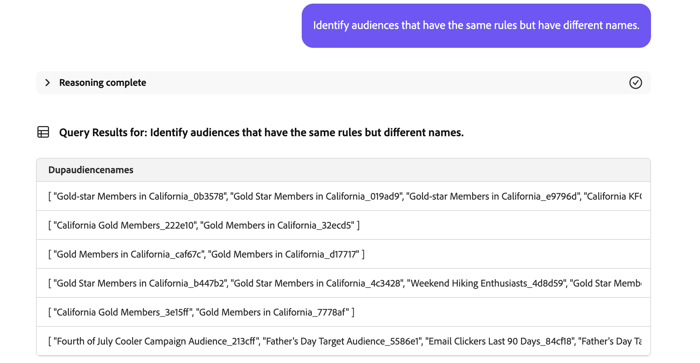

# Audience Agent

>[!AVAILABILITY]
>
>Audience Agentは、AI アシスタントにアクセスできるすべてのお客様が利用できます。 ただし、Audience Agentの機能を完全に使用するには、次の権限が必要になります。
>
>**セグメントの表示**：この権限を持つユーザーは、Audience Agentを使用して AI アシスタントで直接オーディエンスに関するインサイトを表示できます。
>
>**セグメントの管理**：権限があれば、Audience Agentを使用して AI アシスタントで新しいオーディエンスを直接作成できます。

Audience Agentを使用すると、オーディエンスサイズの大きな変化の検出、重複オーディエンスの検出、オーディエンスインベントリの調査、オーディエンスのサイズの取得など、オーディエンスに関するインサイトを表示できます。

>[!SLIDE](audience-agent-overview)

## サポートされるユースケース

AI アシスタント内のAudience Agentは、次のユースケースをサポートします。

- 対話型でオーディエンスを探索
   - 既存オーディエンスのオーディエンスサイズの検索
   - という名前の完全または部分的な属性に基づいてオーディエンスを検索
   - 重複するオーディエンスの検出
   - オーディエンスの定義に使用できる XDM フィールドを見つける
- オーディエンスサイズの大きな変化を検出
   - これにより、急激に増加または縮小したオーディエンスを見つけることができ、潜在的な市場変化をより詳細に分析できます

<!-- - Find your audience size and detect significant changes in audience size
  - This lets you find audiences that have suddenly grown or shrunk, letting you better analyze potential market changes
- Detect duplicate audiences
  - This lets you reduce redundancies with your created audiences
- Find audiences based on full or partial attributes named
  - This lets you more easily navigate through your audience inventory
- Discover XDM fields you can use to define an audience
  - This skill lets you more easily identify the right fields to use in your audience based on context and relevance -->

Audience Agentは、（現在 **次の機能をサポートしていません**。

- ナレッジベースのオーディエンス作成
   - ナレッジベースのオーディエンス作成は、指定された属性とイベントに基づいてオーディエンスを作成することです
   - さらに、オーディエンスの作成前に、オーディエンスの潜在的なサイズを見積もることができます。 これにより、アクティブ化の準備が整う前に、最も効果的なオーディエンスに対してすばやく繰り返し処理を行うことができます
   - この機能のサポートは、近日中に提供されます
- 目標ベースのオーディエンス探索
   - 目標ベースのオーディエンス探索を使用すると、購入や変換の傾向などの機械学習モデルを適用することで、ビジネス目標に合致した関連データセットとプロファイルを見つけることができます。

さらに、Audience Agentを使用する際は、次の制限事項に注意する必要があります。

- Audience Agentによるデータの処理には少なくとも 24 時間かかります
   - 例えば、過去 24 時間以内のデータを検索するクエリを作成する **できません**。 少なくとも過去 48 時間以内に確認する必要があります。
- Audience Agentでは、次のオーディエンスタイプのみをサポートしています。
   - バッチセグメント化を使用して評価される **People ベース** オーディエンス
   - **アカウントベース** のオーディエンス。次のユースケースに対応：
      - 会話型オーディエンスの探索
      - 重複オーディエンスの検出

## サンプルプロンプト

次の例は、Audience Agentのサンプルプロンプトと応答を示しています。

### 会話型オーディエンスの探索

裕福な買い手のフィールドを表示する

+++ 応答

+++

過去 30 日間にどのキャンペーンでもアクティブ化または使用されていないオーディエンスはどれですか？

+++ 応答

+++

過去 3 か月以内に新しい宛先にマッピングされたオーディエンスをすべてリストします。

+++ 応答

+++

最大のオーディエンスサイズを持つアカウントオーディエンスとそのサイズはどれですか？

+++ 応答

+++

### 重複するオーディエンスの検出

説明が同じまたは類似したオーディエンスはありますか？

+++ 応答

+++

ルールは同じでも、名前が異なるオーディエンスを特定します。

+++ 応答

+++

ルールは同じでも、アクティブ化の宛先が異なるすべてのオーディエンスを表示します。

+++ 応答

+++

ルールは同じでも、名前が異なるアカウントオーディエンスを特定します。

+++ 応答

+++

### オーディエンスサイズの取得

オーディエンス「Gold-star Members in California_f153e1」の現在のサイズを教えてください。

+++ 応答

+++

私の最も多い聴衆は何ですか？

+++ 応答

+++

### オーディエンスサイズの大きな変化を検出

先週、サイズが 20% 以上増加したオーディエンスはどれですか？

+++ 応答

+++

先月サイズが 10% 以上減少したオーディエンスはどれですか？

+++ 応答

+++

最も急速に成長しているオーディエンスは何ですか？

+++ 応答

+++

## 次の手順

このガイドを読むことで、Audience Agentとそのサポートする機能について、理解を深めることができました。 Adobe Experience Platformのエージェントについて詳しくは、[Agent Orchestratorの概要 &#x200B;](./agent-orchestrator.md) を参照してください。

