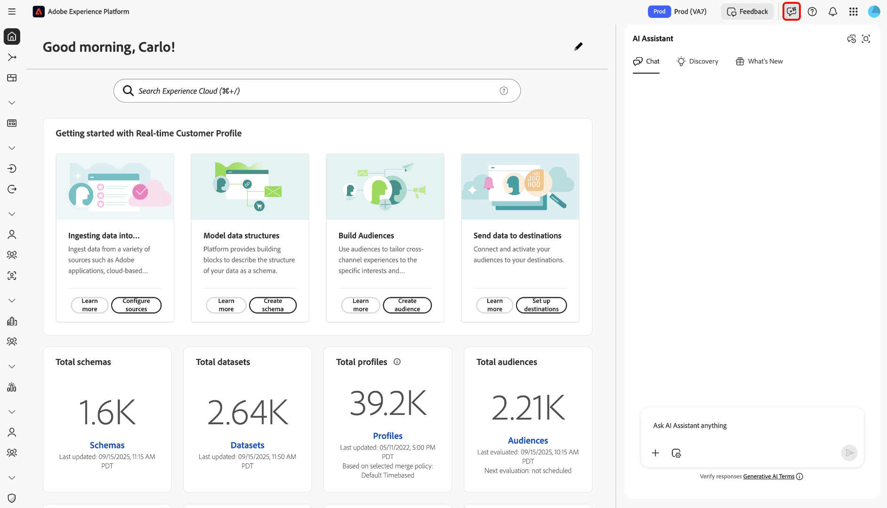
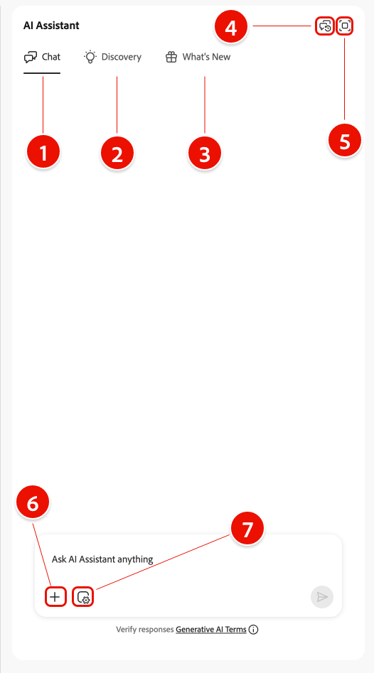
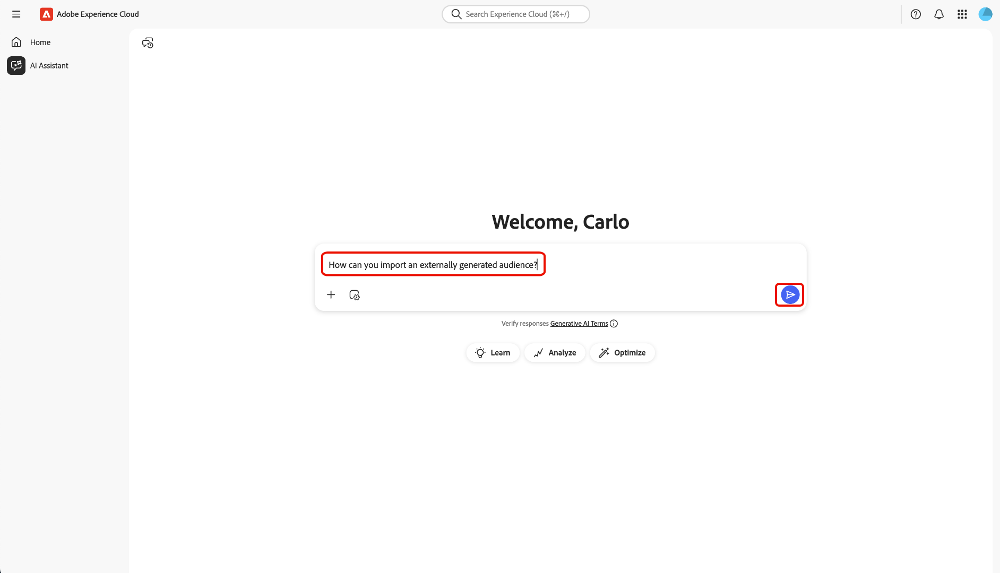
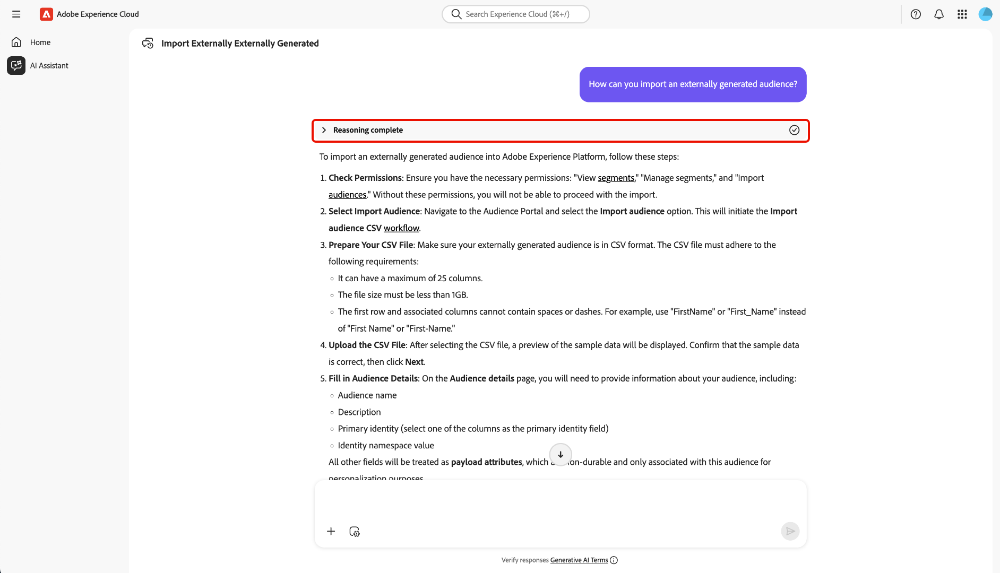
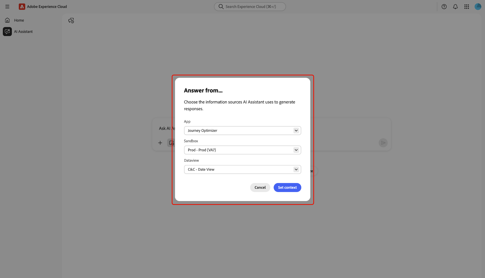
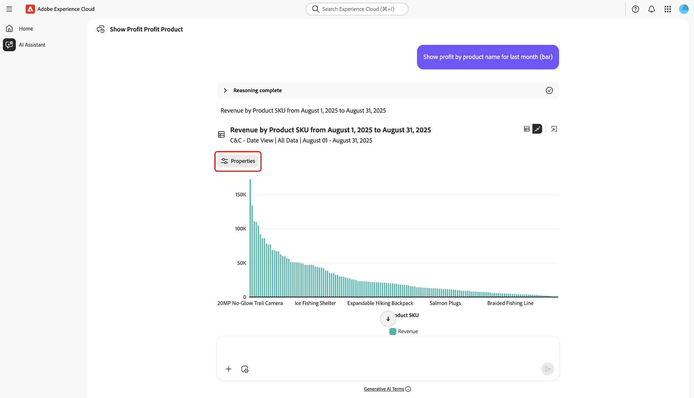

# AI アシスタント

>[!IMPORTANT]
>
>このドキュメントは、AI アシスタント（次世代）に適用されます。 AI アシスタント （従来）について詳しくは、Adobe Experience Platform ドキュメントの[AI アシスタント UI ガイド &#x200B;](https://experienceleague.adobe.com/ja/docs/experience-platform/ai-assistant/home)を参照してください。

AI アシスタント（レガシー）とAI アシスタント（次世代）の比較については、次の表を参照してください。

| 機能領域 | AI アシスタント（レガシー） | AI アシスタント（次世代型） |
| --- | --- | --- |
| ユーザーエクスペリエンス | AI アシスタント（レガシー）は、右側のパネルでのみ使用できます。 | AI アシスタント（次世代）は、右側のパネルと没入型のフルスクリーン体験の両方で利用できます。 |
| 機能の範囲 | AI アシスタント（レガシー）は、製品知識と運用インサイトの両方に活用できます。 | AI アシスタント（次世代）は、製品知識、運用インサイト、高度なエージェント型スキル、マルチステップのタスク実行などに使用できます。 |
| プラットフォームアーキテクチャ | AI アシスタント（レガシー）は、Agent Orchestratorスタック上に構築されていません。 | [Adobe Experience Platform Agent Orchestrator](https://experienceleague.adobe.com/ja/docs/experience-cloud-ai/experience-cloud-ai/agents/agent-orchestrator)が提供するAI アシスタント （次世代）は、機能をまたいで拡張性と高度な連携を可能にします。 |
| 適用範囲 | AI アシスタント（レガシー）は、アプリケーション固有の実装です。 | AI アシスタント（次世代）を利用すれば、あらゆるAdobe Experience Cloudアプリケーションをまたいで、統合されたAI アシスタント体験を実現できます。 |
| アクセスと権限のモデル | アプリケーション範囲のアクセスモデルを個々の製品境界に合わせて調整。 | 利用者は誰でも、AI アシスタント（次世代）と関連するExperience Platformエージェントにアクセスできます。 **メモ**: <ul><li>**Adobe Experience Manager**：管理者は、[Adobe Admin Console](https://helpx.adobe.com/jp/enterprise/using/admin-console.html)を通じてAI アシスタント （Next-Gen）にアクセスする権限を付与する必要があります。</li><li>**Customer Journey Analytics**：管理者は、[Customer Journey Analytics アクセス制御](https://experienceleague.adobe.com/en/docs/analytics-platform/using/technotes/access-control?lang=en)を通じてAI アシスタントにアクセスする権限を付与する必要があります。 これにより、製品知識やデータインサイトにもとづいた質問が可能になります。 |

AI アシスタントは、Adobe Experience Platformベースのアプリケーションの生産性を向上させ、作業を再定義する、インテリジェントな会話型の生成AI ツールです。 AI アシスタントを使用して、Adobe Experience Platform Agentsやその他のAI機能にアクセスできます。

AI アシスタントの活用方法について、アドビのガイドでご確認ください。

>[!SLIDE](agent-orchestrator-ui)

## AI アシスタントへのアクセス

AI アシスタントにアクセスする方法はいくつかあります。

Experience Cloudのホームインターフェイスで、左側のナビゲーションから「**[!UICONTROL AI アシスタント]**」を選択して、AI アシスタントのフルスクリーンビューを起動します。

+++選択して表示

+++

また、Experience Platform、Adobe Journey Optimizer、Customer Journey AnalyticsなどのExperience Cloud アプリケーションのホームページからAI アシスタントを起動することもできます。 製品ホームページに移動し、上部ヘッダーから&#x200B;**AI アシスタントアイコン**&#x200B;を選択して、右側のパネルでAI アシスタントチャットパネルを起動します。

+++選択して表示

+++

## AI アシスタントユーザーインターフェイスのナビゲーション

この節では、AI アシスタントのインターフェイスを操作する方法について説明します。

### 全画面表示

AI アシスタントインターフェイスには、効果的なインタラクションを実現するための重要な要素がいくつか含まれています。

1. **[!UICONTROL 会話]**: **[!UICONTROL 会話]** アイコンを選択して、新しい会話を開始し、履歴から最近の会話にアクセスします。 詳しくは、[会話](#conversations)の節を参照してください。
2. **入力ボックス**：入力ボックスを選択して、AI アシスタントの質問とプロンプトを入力します。 詳しくは、[入力機能](#input-features)の節を参照してください。
3. **データとオブジェクトのオートコンプリート**: - プラスアイコンを選択して、データとオブジェクトの提案とオートコンプリートを使用します。 このオプションを選択すると、ポップアップウィンドウを使用して、提案されたエンティティを選択できます。 詳しくは、[&#x200B; データとオブジェクトのオートコンプリート &#x200B;](#autocomplete)に関する節を参照してください。
4. **コンテキスト設定**: - AI アシスタントの情報ソースを設定するには、コンテキスト設定アイコンを選択します。 このツールを使用して、AI アシスタントが参照するアプリケーション、サンドボックス、データビューを設定し、クエリに回答できます。 詳しくは、[&#x200B; コンテキスト設定](#context-setting)の節を参照してください。
5. **Discovery**: - **[!UICONTROL Learn]**、**[!UICONTROL Analyze]**、**[!UICONTROL Optimize]**&#x200B;を選択して、開始に使用できるサンプルクエリを表示します。 詳しくは、[見つけやすさのプロンプト &#x200B;](#discoverability-prompts)に関する節を参照してください。

### レールビュー

パネル表示では、コンパクトなパネルでチャット、検出プロンプト、更新、会話、およびインターフェイスのコントロールにすばやくアクセスできます。

1. **[!UICONTROL チャット]**: ヘッダーから&#x200B;**[!UICONTROL チャット]**&#x200B;を選択して、インターフェイス上の様々な要素にアクセスするために残したイベントで会話に戻ります。
1. **[!UICONTROL 検出]**: **[!UICONTROL 検出]**&#x200B;を選択すると、カテゴリ別に整理されたAI アシスタント プロンプトのリストが表示されます。 これらの事前設定済みのプロンプトを使用して、チャットに情報を入力できます。 さらに、特定のユースケースに合わせて、提案されたプロンプトを調整することもできます。
1. **[!UICONTROL 新機能]**: **[!UICONTROL 新機能]**&#x200B;を選択すると、AI アシスタントで利用できる最新の更新情報のリストが表示されます。
1. **[!UICONTROL 会話]**: **[!UICONTROL 会話]** アイコンを選択して、新しい会話を開始し、履歴から最近の会話にアクセスします。 詳しくは、[会話](#conversations)の節を参照してください。
1. **全画面表示**: **[!UICONTROL 全画面表示]** アイコンを選択して、AI アシスタント インターフェイスを右側のパネルから全画面モードに変更します。
1. **データとオブジェクトのオートコンプリート**: データとオブジェクトの提案とオートコンプリートを使用するには、プラスアイコンを選択します。 このオプションを選択すると、ポップアップウィンドウを使用して、提案されたエンティティを選択できます。 詳しくは、[&#x200B; データとオブジェクトのオートコンプリート &#x200B;](#autocomplete)に関する節を参照してください。
1. **コンテキスト設定**: AI アシスタントの情報ソースを設定するには、コンテキスト設定アイコンを選択します。 このツールを使用して、AI アシスタントが参照するアプリケーション、サンドボックス、データビューを設定し、クエリに回答できます。 詳しくは、[&#x200B; コンテキスト設定](#context-setting)の節を参照してください。

## AI アシスタント UI ガイド

この節では、AI アシスタント ユーザーインターフェイスの主な機能とナビゲーションオプションの概要を説明します。 AI アシスタントへのアクセス方法、フルスクリーンビューとレールビューの両方におけるレイアウトとコントロールの概要、会話、入力機能、オートコンプリート、コンテキスト設定、検出プロンプトなどの主要なツールを紹介します。 以下のセクションでは、これらの機能を使用してAI アシスタントとやり取りし、エクスペリエンスを最大限に活用するための詳細なガイダンスを提供します。

### 検出プロンプト {#discovery-prompts}

AI アシスタントの検出機能を使用すると、AI アシスタントがサポートするエンティティにグループ化された一般的なオブジェクトのリストを表示できます。 検出プロンプトは、出発点によって異なります。

>[!BEGINTABS]

>[!TAB  フルスクリーンビューからの検出の使用]

フルスクリーン表示では、検出プロンプトは、**[!UICONTROL 学習]**、**[!UICONTROL 分析]**、**[!UICONTROL 最適化]**&#x200B;の3つのカテゴリに分類されます。

検出プロンプトを使用して製品情報を進めるには、**[!UICONTROL 学習]**&#x200B;を選択し、表示されるドロップダウンウィンドウからプロンプトを選択します。

>[!TAB  レール ビューから検出を使用]

パネル表示から「**[!UICONTROL 検出]**」を選択すると、AI アシスタントを使用してチャットを開始し、入力するために使用できる検出プロンプトの広範なリストにアクセスできます。

>[!ENDTABS]

入力ボックスに入力するプロンプトを選択します。 ここから、特定のユースケースに合わせてプロンプトを編集できます。 準備ができたら、右側の送信アイコンを選択してクエリを送信します。

## 応答の操作

### 推論プロセスの確認 {#reasoning}

次に、AI アシスタントがナレッジベースにクエリを発行し、回答を計算します。 AI アシスタントは、数分後に、その推論プロセス、関連する提案、情報ソース、フィードバックツールなどを深く掘り下げるオプションを含む回答を返します。

基礎となる推論プロセスをより深く理解するには、**[!UICONTROL 推論完了]**&#x200B;を選択します。

「*[!UICONTROL 推論完了]*」ウィンドウが展開され、リクエストの概要と、レスポンスの作成方法の詳細が表示されます。

### 関連する提案を使用

次に、応答の一番下まで移動し、**[!UICONTROL 関連する提案]**&#x200B;を選択して、最初のクエリに関連するプロンプトのリストを受け取ります。 これらのプロンプトを使用して、AI アシスタントでさらに会話を進めることができます。

### ソースを表示

AI アシスタントの応答を確認するには、**[!UICONTROL ソース]**&#x200B;を選択して、AI アシスタントが応答を計算する際に参照した情報ソースのリストを表示します。

### フィードバックの提供

回答で提供されているオプションを使用して、AI アシスタントでエクスペリエンスのフィードバックを提供することができます。

フィードバックを提供するには、AI アシスタントから回答を受け取った後、「上向き」または「下向き」のどちらかを選択し、提供されたテキストボックスにフィードバックを入力します。

>[!BEGINTABS]

>[!TAB  サムズアップ ]

「**[!UICONTROL 親指を上へ]**」を選択して、肯定的なフィードバックを提供します。 オプションで、肯定的なフィードバックのリストから選択するか、入力ボックスを使用して独自の特定のフィードバックを入力できます。

+++選択して表示

**[!UICONTROL 詳細なフィードバック]**&#x200B;を選択して、フィードバックをさらに詳しく説明することもできます。 終了したら、「**[!UICONTROL 送信]**」を選択します。

+++

>[!TAB  サムズダウン ]

**[!UICONTROL 親指を下げる]**&#x200B;を選択して、建設的なフィードバックを提供します。 オプションで、建設的なフィードバックのリストから選択するか、入力ボックスを使用して独自の特定のフィードバックを入力できます。

+++選択して表示

同様に、**[!UICONTROL 詳細なフィードバック]**&#x200B;を選択して、フィードバックをさらに詳しく説明することもできます。 終了したら、「**[!UICONTROL 送信]**」を選択します。

+++

>[!ENDTABS]

### 分割ビュー機能の使用

AI アシスタントの応答に画像が含まれる場合は、パスアイコンを選択してスプリットビューモードを起動できます。 これにより、右側にコンテキスト画像が表示され、AI アシスタントの応答全体を読むことができます。

### 会話

*[!UICONTROL すべての会話]* パネルを使用して、AI アシスタントとの会話をリセットおよび再訪問できます。 **[!UICONTROL 会話]** アイコンを選択して、*[!UICONTROL すべての会話]* ウィンドウを表示します。

以前の会話を再度確認するには、提供されたリストから会話トピックを選択します。

新しい会話を開始するには、**[!UICONTROL 新しい会話]**&#x200B;を選択します。

### コンテキスト設定 {#context-setting}

AI アシスタントのコンテキスト設定機能を使用して、AI アシスタントが参照する&#x200B;**アプリケーション**、**サンドボックス**&#x200B;および&#x200B;**データビュー**&#x200B;を設定し、クエリに回答します。 コンテキスト設定にアクセスするには、入力ボックスから「**[!UICONTROL コンテキスト設定]**」アイコンを選択します。

「*[!UICONTROL 回答者…]*」ポップアップウィンドウが表示されます。 このウィンドウを使用して、使用する情報ソースを設定し、**[!UICONTROL コンテキストを設定]**&#x200B;を選択します。

| 情報ソース | 説明 | 例 |
| --- | --- | --- |
| アプリ | クエリに関連するExperience Cloud アプリケーション。 | Experience Platform、Journey Optimizer、Customer Journey Analyticsなど。 |
| サンドボックス | クエリに関連するデータセットまたは情報を含むサンドボックス。 | 製品（VA7）、開発。 |
| Dataview | Customer Journey AnalyticsでAI アシスタントを使用する場合、データビュー設定はData Insights Agentが次のことを理解するのに役立ちます。 <ul><li>クエリするデータセット</li><li>利用可能なデータコンポーネント</li><li>データに対する回答を構造化する方法</li><li>Analysis Workspaceで作成するビジュアライゼーション</li></ul> | |

### データとオブジェクトのオートコンプリート

オートコンプリート関数を使用すると、サンドボックスに存在するデータオブジェクトのリストを受け取ることができます。 オートコンプリートを使用するには、クエリにプラスアイコン（+）を入力します。 別の方法として、テキスト入力ボックスの下部にあるプラスアイコン（+）を選択することもできます。 サンドボックスから推奨されるデータオブジェクトのリストが表示されます。

### 応答を確認

AI アシスタントからの回答を検証する方法は、いくつかあります。 「**[!UICONTROL オブジェクトに一致するクエリ用語]**」を選択すると、組織内の特定のオブジェクトに一致したクエリ内の用語の概要が表示されます。

「**[!UICONTROL 」を選択すると、AI アシスタントがどのように回答に到達したかを詳細にステップバイステップで説明できます（]**）。 さらに、質問に回答するために実行されたSQL クエリを表示することもできます。 このクエリは読み取り専用であり、クエリサービスでの使用はサポートされていません。

### データビジュアライゼーションの設定

AI アシスタントのデータビジュアライゼーション機能を使用すれば、データをより深く理解できます。 また、クエリで使用するグラフのタイプを指定することもできます。 例えば、次のようなクエリを送信します。**「先月の製品名で利益を表示する（棒）」**。先月の利益の棒グラフを製品名で整理して受け取ります。

次に、**[!UICONTROL プロパティ]**&#x200B;を選択して、グラフの種類を変更し、X軸とY軸の値を設定します。

AI アシスタントは、データの可視化のために、いくつかのグラフタイプをサポートしています。 データにカーソルを合わせることで、あらゆるタイプのグラフを操作できます。

>[!BEGINTABS]

>[!TAB Line]

折れ線グラフを表示するには、**[!UICONTROL プロパティ]**&#x200B;を選択し、**[!UICONTROL 折れ線]**&#x200B;を選択します。

>[!TAB  エリア ]

階層グラフを表示するには、「**[!UICONTROL プロパティ]**」を選択してから「**[!UICONTROL 領域]**」を選択します。

>[!TAB 散布図]

散布図を表示するには、**[!UICONTROL プロパティ]**&#x200B;を選択してから、**[!UICONTROL 散布図]**&#x200B;を選択します。

>[!TAB ドーナツ]

ドーナツグラフを表示するには、「**[!UICONTROL プロパティ]**」を選択し、「**[!UICONTROL ドーナツ]**」を選択します。

>[!ENDTABS]
