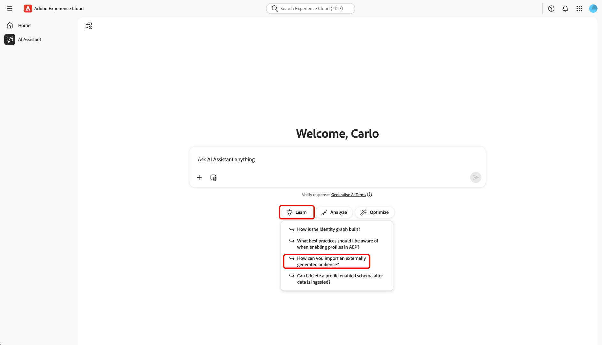

# AI アシスタント

AI アシスタントは、Adobe Experience Platform ベースのアプリケーションで生産性を向上させ、作業を再定義するインテリジェントな会話型ジェネレーティブ AI ツールです。 AI アシスタントを使用して、Adobe Experience Platform Agent やその他の AI 機能にアクセスできます。

AI アシスタントの使用方法については、このガイドをお読みください。

## AI アシスタントにアクセス

AI アシスタントにアクセスする方法はいくつかあります。

Experience Cloudのホームインターフェイスで、左側のナビゲーションから **[!UICONTROL AI アシスタント]** を選択して、AI アシスタントの全画面表示を開始します。

+++選択して表示

+++

また、Experience Platform、Adobe Journey Optimizer、Customer Journey AnalyticsなどのExperience Cloud アプリケーションのホームページから AI アシスタントを起動することもできます。 製品のホームページに移動し、上部のヘッダーから **AI Assistant アイコン** を選択して、右側のパネルにある AI Assistant チャットパネルを起動します。

+++選択して表示

+++

## AI アシスタントのユーザーインターフェイスの操作

AI アシスタントのインターフェイスをナビゲートする方法については、この節を参照してください。

### 全画面表示

AI アシスタント インターフェイスには、効果的にやり取りするのに役立つ重要な要素がいくつか含まれています。

1. **[!UICONTROL 会話]**: **[!UICONTROL 会話]** アイコンを選択して新しい会話を開始し、履歴から最近の会話にアクセスします。 詳しくは、[conversations](#conversations) の節を参照してください。
2. **入力ボックス**：入力ボックスを選択して、AI アシスタントの質問とプロンプトを入力します。 詳しくは、[ 入力機能 ](#input-features) の節を参照してください。
3. **データとオブジェクトのオートコンプリート**: - データとオブジェクトの提案とオートコンプリートを使用するには、プラスアイコンを選択します。 このオプションを選択すると、ポップアップウィンドウを使用してエンティティの候補を選択できます。 詳しくは、[ データとオブジェクトのオートコンプリート ](#autocomplete) の節を参照してください。
4. **コンテキスト設定**: - AI アシスタントの情報ソースを設定するには、「コンテキスト設定」アイコンを選択します。 このツールを使用して、AI アシスタントがクエリに回答するために参照するアプリケーション、サンドボックス、データビューを設定できます。 詳しくは、[ コンテキスト設定 ](#context-setting) の節を参照してください。
5. **検出**: - **[!UICONTROL 学習]**、**[!UICONTROL 分析]** および **[!UICONTROL 最適化]** を選択して、開始するために使用できるサンプルクエリを表示します。 詳しくは、[ 検出性プロンプト ](#discoverability-prompts) の節を参照してください。

### パネルビュー

パネルビューを使用すると、コンパクトパネルで、チャット、検出プロンプト、更新、会話、インターフェイスコントロールにすばやくアクセスできます。

1. **[!UICONTROL チャット]**：ヘッダーから **[!UICONTROL チャット]** を選択すると、インターフェイス上の異なる要素にアクセスするために残したイベントの会話に戻ります。
1. **[!UICONTROL 探索]**: **[!UICONTROL 探索]** を選択すると、AI アシスタントのプロンプトがカテゴリ別に整理されたリストが表示されます。 これらの事前設定済みのプロンプトを使用して、チャットに入力できます。 さらに、提案されたプロンプトを調整して、特定のユースケースに合わせることができます。
1. **[!UICONTROL 新機能]**: **[!UICONTROL 新機能]** を選択すると、AI アシスタントで利用可能な最新のアップデートのリストが表示されます。
1. **[!UICONTROL 会話]**: **[!UICONTROL 会話]** アイコンを選択して新しい会話を開始し、履歴から最近の会話にアクセスします。 詳しくは、[conversations](#conversations) の節を参照してください。
1. **全画面表示**:「**[!UICONTROL 全画面表示]**」アイコンを選択して、AI アシスタントのインターフェイスを右側のパネルから全画面表示モードに変更します。
1. **データとオブジェクトのオートコンプリート**：データとオブジェクトの提案およびオートコンプリートを使用するには、プラスアイコンを選択します。 このオプションを選択すると、ポップアップウィンドウを使用してエンティティの候補を選択できます。 詳しくは、[ データとオブジェクトのオートコンプリート ](#autocomplete) の節を参照してください。
1. **コンテキスト設定**:「コンテキスト設定」アイコンを選択して、AI アシスタントの情報ソースを設定します。 このツールを使用して、AI アシスタントがクエリに回答するために参照するアプリケーション、サンドボックス、データビューを設定できます。 詳しくは、[ コンテキスト設定 ](#context-setting) の節を参照してください。

## AI アシスタント UI ガイド

ここでは、AI アシスタントのユーザーインターフェイスの主な機能とナビゲーションオプションの概要を説明します。 ここでは、AI アシスタントへのアクセス方法、全画面表示とパネル表示のレイアウトとコントロールの説明、会話、入力機能、オートコンプリート、コンテキスト設定、検出プロンプトなどの主要ツールについて説明します。 以下のセクションでは、これらの機能を使用して AI アシスタントとやり取りし、エクスペリエンスを最大限に活用する方法について詳しく説明します。

### 検出プロンプト

AI アシスタントの検出機能を使用して、AI アシスタントがサポートする一般主題のリストをエンティティにグループ化して表示できます。 検出のプロンプトは、出発点によって異なります。

>[!BEGINTABS]

>[!TAB  全画面表示から検出を使用する ]

全画面表示では、検出プロンプトは、**[!UICONTROL 学習]**、**[!UICONTROL 分析]**、**[!UICONTROL 最適化]** の 3 つのカテゴリにグループ化されます。

検出プロンプトを使用して製品の知識を深めるには、「**[!UICONTROL 学習]**」を選択し、表示されるドロップダウンウィンドウからプロンプトを選択します。

>[!TAB  パネルビューからの Discover の使用 ]

パネルビューから **[!UICONTROL 検出]** を選択すると、検出プロンプトの広範なリストにアクセスできます。検出プロンプトは、開始して AI アシスタントとチャットに入力するために使用できます。

>[!ENDTABS]

入力ボックスに入力するプロンプトを選択します。 ここから、特定の使用例に合わせてプロンプトを編集できます。 準備が整ったら、右側の送信アイコンを選択して、クエリを送信します。

## 回答とのやり取り

### 推論プロセスのチェック {#reasoning}

次に、AI アシスタントがナレッジベースに問い合わせて、回答を計算します。 しばらくすると、AI アシスタントが回答を返します。これには、推論プロセス、関連する提案、情報源、フィードバックツールをより深く掘り下げるためのオプションが含まれます。

基礎となる推論プロセスをより深く理解するには、**[!UICONTROL 推論の完了]** を選択します。

*[!UICONTROL 推論完了]* ウィンドウが展開され、リクエストの概要と、応答の作成方法の詳細が表示されます。

### 関連する提案を使用

次に、応答の下部に移動し、**[!UICONTROL 関連候補]** を選択して、最初のクエリに関するプロンプトのリストを受け取ります。 これらのプロンプトを使用して、AI アシスタントとさらに会話を続けることができます。

### ソースを表示

AI アシスタントの応答を確認するには、[**[!UICONTROL ソース]**] を選択して、AI アシスタントが応答の計算時に参照する情報ソースのリストを表示します。

### フィードバックを提供

回答に用意されているオプションを使用して、AI アシスタントでエクスペリエンスのフィードバックを提供できます。

フィードバックを入力するには、AI アシスタントから応答を受信した後で [ サムネイルを上へ ] または [ サムネイルを下へ ] を選択し、表示されたテキスト ボックスにフィードバックを入力します。

>[!BEGINTABS]

>[!TAB  親指を立てる ]

**[!UICONTROL サムズアップ]** を選択して、ポジティブフィードバックを提供します。 必要に応じて、ポジティブフィードバックのリストから選択するか、入力ボックスを使用して独自の特定のフィードバックを入力できます。

+++選択して表示

また、「**[!UICONTROL 詳細なフィードバック]**」を選択して、フィードバックをさらに詳しく説明することもできます。 終了したら、「**[!UICONTROL 送信]**」を選択します。

+++

>[!TAB  サムズダウン ]

**[!UICONTROL サムズダウン]** を選択して、建設的なフィードバックを提供します。 必要に応じて、建設的なフィードバックのリストから選択したり、入力ボックスを使用して独自の特定のフィードバックを入力したりできます。

+++選択して表示

同様に、**[!UICONTROL 詳細なフィードバック]** を選択して、フィードバックをさらに詳しく説明することもできます。 終了したら、「**[!UICONTROL 送信]**」を選択します。

+++

>[!ENDTABS]

### 分割ビュー機能の使用

AI アシスタントの応答に画像が含まれる場合は、パスアイコンを選択して分割ビューモードを起動できます。 これにより、右側に表示されるコンテキスト画像を使用して、AI アシスタントの応答全体を読み取ることができます。

### 会話

*[!UICONTROL すべての会話]* パネルを使用して、AI アシスタントで会話をリセットして再訪問できます。 **[!UICONTROL すべての会話]** ウィンドウを表示するには、*[!UICONTROL 会話]* アイコンを選択します。

以前の会話に再度アクセスするには、表示されたリストから会話トピックを選択します。

新しい会話を開始するには、「**[!UICONTROL 新しい会話]**」を選択します。

### コンテキスト設定 {#context-setting}

AI Assistant のコンテキスト設定機能を使用して、AI Assistant が参照する **application**、**sandbox**、および **dataview** を設定し、クエリに回答します。 コンテキスト設定にアクセスするには、「**[!UICONTROL コンテキスト設定]**」アイコンを入力ボックスから選択します。

*[!UICONTROL Answer from...]* ポップアップウィンドウが表示されます。 このウィンドウを使用して、使用する情報ソースを設定し、「コンテキストを設定 **[!UICONTROL を選択し]** す。

| 情報ソース | 説明 | 例 |
| --- | --- | --- |
| アプリ | クエリが関連するExperience Cloud アプリケーション。 | Experience Platform、Journey Optimizer、Customer Journey Analyticsなど |
| Sandbox | クエリが関連するデータセットや情報を含んだサンドボックス。 | 実稼動（VA7）、開発 |
| データビュー | Customer Journey Analyticsで AI アシスタントを使用している場合、データビュー設定はData Insights Agentが以下を理解するのに役立ちます。 <ul><li>クエリするデータセット</li><li>使用可能なデータコンポーネント</li><li>データに関する応答の構造化方法</li><li>Analysis Workspaceで作成するビジュアライゼーション</li></ul> |

### データとオブジェクトのオートコンプリート

オートコンプリート関数を使用して、サンドボックスに存在するデータオブジェクトのリストを受け取ることができます。 オートコンプリートを使用するには、クエリにプラスアイコン（+）を入力します。 または、テキスト入力ボックスの下部にあるプラスアイコン（+）を選択することもできます。 ウィンドウが開き、サンドボックスから推奨されるデータオブジェクトのリストが表示されます。

### 応答の検証

AI アシスタントからの応答を確認する方法はいくつかあります。 「**[!UICONTROL オブジェクトと一致する用語をクエリ]**」を選択すると、組織内の特定のオブジェクトと一致するクエリ内の用語の概要が表示されます。

**[!UICONTROL 以下は、結果を得た方法です]** を選択して、AI アシスタントが回答にどのように到達したかについて詳細な手順を確認します。 さらに、質問に回答するために実行された SQL クエリを表示することもできます。 このクエリは読み取り専用で、クエリサービスでの使用はサポートされていません。

### データビジュアライゼーションの設定

AI アシスタントのデータビジュアライゼーション機能を使用すると、データをより深く理解できます。 また、クエリで使用するグラフのタイプを指定することもできます。 例えば、「**先月の製品名で利益を表示（棒）」** というクエリを送信すると、先月の利益の棒グラフを製品名別に整理して受け取ります。

次に、「**[!UICONTROL プロパティ]**」を選択して、グラフタイプを変更し、X 軸と Y 軸の値を設定します。

AI アシスタントは、データ ビジュアライゼーション用に複数のグラフ タイプをサポートします。 データの上にマウスポインターを置くと、すべてのタイプのグラフを操作できます。

>[!BEGINTABS]

>[!TAB  行 ]

折れ線グラフを表示するには、「プロパティ **[!UICONTROL を選択してから]** 折れ線グラフ **[!UICONTROL を選択し]** す。

>[!TAB  面積 ]

面グラフを表示するには、**[!UICONTROL プロパティ]** を選択してから **[!UICONTROL 面グラフ]** を選択します。

>[!TAB  散布図 ]

散布図を表示するには、「**[!UICONTROL プロパティ]**」を選択し、「**[!UICONTROL 散布図]**」を選択します。

>[!TAB  ドーナツ ]

ドーナツグラフを表示するには、「**[!UICONTROL プロパティ]**」を選択してから、「**[!UICONTROL ドーナツ]**」を選択します。

>[!ENDTABS]