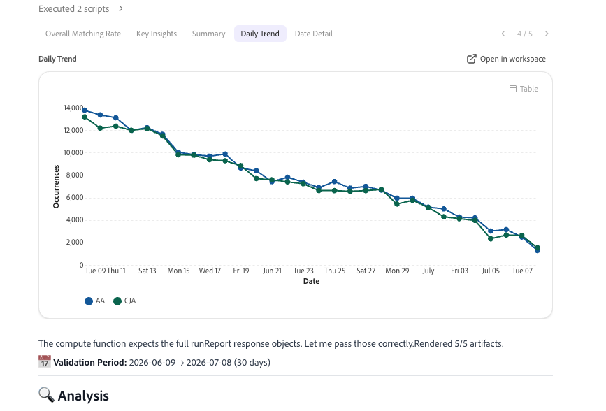

# Adobe AnalyticsからCustomer Journey Analyticsにアップグレードする際に、Coworkerでデータを検証する

>[!NOTE]
> 
>このページの手順は、以前のすべてのアップグレード手順を完了した後にのみ実行します。 推奨されるアップグレード手順（ほとんどの組織で推奨）に従うか、Customer Journey Analytics アップグレードガイドで組織に応じて動的に生成される手順に従うことができます。 <ul><li>**推奨されるアップグレード手順** （ほとんどの組織で推奨）
Adobe Customer Journey Analyticsを導入するための一連のステップ。

詳しくは、[Adobe AnalyticsからCustomer Journey Analyticsへのアップグレード ](https://experienceleague.adobe.com/en/docs/analytics-platform/using/compare-aa-cja/upgrade-to-cja/cja-upgrade-recommendations)を参照してください。
</li><li>**Customer Journey Analytics アップグレードガイド** （組織の特定のニーズに合わせたカスタム手順）
組織と独自の状況に合わせてカスタマイズされたアップグレード手順を動的に生成する新しいアップグレードガイドを利用できます。

Customer Journey Analyticsからガイドにアクセスするには、「**[!UICONTROL Workspace]**」タブを選択し、左側のパネルで「**[!UICONTROL Customer Journey Analyticsにアップグレード]**」を選択します。 画面の指示に従います。
</li></ul>

CX Enterprise Coworkerには、Adobe AnalyticsからCustomer Journey Analyticsにアップグレードする際にデータを検証できる検証スキルが含まれています。 データ検証は、1回の会話で完了します。

このスキルは自動的に比較されます：

* 実装全体で個別に行うことができます。

* すべてのAdobe Analytics データビューに対するすべてのCustomer Journey Analytics レポートスイート。

これらの比較を行った後、AI主導のインサイトとレコメンデーションを生成し、Customer Journey Analyticsへのアップグレードを促進します。

## 始める前に

アップグレードの一環としてデータを検証するには、次のものが必要です。

* 検証するAdobe Analytics レポートスイート。

* 同じデータを含むCustomer Journey Analytics データビュー。

実装がどのように設計されているかを知る必要はありません。 このスキルは、Customer Journey Analyticsの実装でAnalytics Source コネクタを使用しているか、Experience Platform Web SDKの新しい実装を使用しているかを自動的に検出します。

## 検証セッションを開始

1. CX Enterprise Coworkerにログインします。

1. [!UICONTROL **新規チャット**]&#x200B;を選択します。

1. テキストフィールドで、Adobe AnalyticsからCustomer Journey Analyticsへのアップグレードを検証するようにエージェントに求めます。

   **プロンプト**

   > Adobe AnalyticsからCustomer Journey Analyticsへの自社のアップグレードの検証を支援します。

   リクエストはデータ検証スキルにルーティングされ、インタラクティブなセットアッププロセスが開始されます。

1. 設定プロセスには、次の表に示す質問が含まれます。 質問ごとに回答を選択し、[!UICONTROL **送信**]&#x200B;を選択します。

   >[!NOTE]
   >
   >後で同じ会話でこれらの選択のいずれかを変更できます。 例えば、担当者にレポートスイートまたはデータビューを変更するように依頼します。担当者は、設定プロセス全体を再起動することなく、その選択を更新するために必要な手順のみを繰り返します。

   | 質問 | その他のコンテキスト |
   |---------|----------|
   | [!UICONTROL **Analytics会社を選択**] | これがAdobe Analyticsのログイン会社です。 |
   | [!UICONTROL **レポートスイートを選択**] <!--In the UI, recommend change to "Select your Adobe Analytics report suite"--> | これは、Customer Journey Analytics データに対して検証するデータを含むAdobe Analyticsのレポートスイートです。 |
   | [!UICONTROL **Customer Journey Analytics データビューを選択**] | これは、選択したAdobe Analytics レポートスイートと同じデータを含むCustomer Journey Analyticsのデータビューです。 |

1. 続行する前に、セットアップの概要を確認して、適切なデータを検証していることを確認してください。 概要には、選択した会社、レポートスイート、データビュー、各システムの上位の指標とディメンションのプレビューが含まれます。

1. 次のセクションに進みます。[検証するデータを選択](#choose-the-data-to-validate)。

## 検証するデータの選択

個々の指標またはディメンションを検証することも、レポートスイートとデータビューに含まれるすべての指標とディメンションを検証することもできます。

1. 次のオプションから選択します。

   | 検証オプション | 説明 |
   |---------|----------|
   | [!UICONTROL **単一の指標の比較**] | Adobe AnalyticsとCustomer Journey Analyticsにおける1つの指標の傾向を比較します。 ページビューや訪問数など、特定の指標を素早く確認したい場合に使用します。 |
   | [!UICONTROL **単一ディメンションの比較**] | Adobe AnalyticsとCustomer Journey Analyticsのディメンションの内訳を比較します。 これは、特定のディメンションのマッピングまたは分類の違いを疑う場合に使用します。 |
   | [!UICONTROL **完全なレポートスイートとデータビュー監査**] | 1回の実行で、最大40のAdobe Analytics指標と20のディメンションをCustomer Journey Analyticsの指標と比較します。 アップグレードの全体的な健全性を包括的に把握したい場合に使用します。 |

1. 次のセクションに進みます。[分析を確認](#review-the-analysis)。

## 分析の確認

1. 「[!UICONTROL **全体的な一致率**]」タブを選択して、Adobe Analytics レポートスイートのデータがCustomer Journey Analytics データビューのデータにどの程度近いかを示す割合を表示します。 このスコアは、常に他の結果よりも先に表示されます。 ページビューなどの大ボリュームの指標でスコアが歪まないように、比較されたあらゆる指標とディメンションを均等に重み付けします。

   スコアを解釈するには、次のスケールを使用します。

   | スコア | レーティング | 意味 |
   |---------|----------|----------|
   | 97%-100% |  [!UICONTROL 良好] | あらゆるプロパティが高度に調整されています。 操作は必要ありません。 |
   | 90%～96% |  [!UICONTROL 良好] | 小さな隙間が存在する。 トレンドを監視し、トレンドが衰退しているかどうかを調査します。 |
   | 75%～89% |  [!UICONTROL  レビュー] | 大きなギャップが存在。 Customer Journey Analyticsのデータを利用する前に、根本原因を調査しましょう。 |
   | 75%未満 |  [!UICONTROL 悪い] | 大きな整合性の低下： Customer Journey Analyticsのデータを利用する前に、すぐに対応する必要があります。 |

1. 「[!UICONTROL **重要なインサイト**]」タブを選択すると、2個から4個の短いコールアウトボックスが表示され、それぞれ分析から1個の結果が1文にまとめられます。 コールアウトは重大度によって色分けされるので、最も重要な結果を最初に見つけることができます。

1. 「[!UICONTROL **概要**]」タブを選択して、Adobe Analyticsの合計、Customer Journey Analyticsの合計、合計の差異、経過日数、および重要な日数を表示します。この期間の経過日数と重要日数は、日付範囲の日数が以下に示す&#x200B;[!UICONTROL **パス**]&#x200B;および&#x200B;[!UICONTROL **クリティカル**]&#x200B;の分散ステータスに該当するかを示します。

1. （条件付き） 1つのディメンション比較または1つの指標の比較を行う場合、「[!UICONTROL **日次トレンド**]」タブで、Adobe Analytics データとCustomer Journey Analytics データを並べて比較できます。

   指標の場合、これは日々のトレンドを比較する折れ線グラフです。

   折れ線グラフを表示する

   ディメンションの場合、これは上位の値を比較する棒グラフです。

   

1. （条件付き）単一ディメンションの比較または単一メトリックの比較を行う場合、「[!UICONTROL **日付の詳細**]」タブで行レベルの詳細を表示できます。 この表は、比較された各指標またはディメンション値の日付、Adobe Analytics値、Customer Journey Analytics値、差異の割合、およびステータスバッジを示しています。

   

   「差異」列と「ステータス」列では、次のスケールが使用されます。

   | 平方偏差 | ステータス | 意味 |
   |---------|----------|----------|
   | 3%未満 |  [!UICONTROL 合格] | データを適切に活用。 操作は必要ありません。 |
   | 3%～10% |  [!UICONTROL  フラグ ] | 違いを監視し、それが継続または悪化するかどうかを調べます。 |
   | 10%以上 |  [!UICONTROL 重要] | すぐに調査。 これは通常、スキーマ、取り込み、またはマッピングの問題を指します。 |

1. （条件付き）完全なレポートスイートとデータビュー監査を実行する際、[!UICONTROL **日次トレンド**]&#x200B;と&#x200B;[!UICONTROL **日次の詳細**] タブは、合格数、フラグ付き数、重要数を示すスコアカードに置き換えられ、上位5つのベストマッチング指標と上位5つの最低マッチング指標とディメンションを示す個別のテーブルが表示されます。

1. 分析を下にスクロールして、分析中に検出された追加のパターンと問題、それらのパターンの可能性のある原因、データの不一致を解決するために実行できるアクションを表示します。

   >[!NOTE]
   >
   >一部の差異は想定されており、Customer Journey Analyticsへのアップグレードに問題があることを示すものではありません。

   一般的な問題は次のとおりです。

   * Adobe Analyticsではデバイスベースの訪問者をカウントし、Customer Journey AnalyticsではデバイスをまたいでIDをつなぎ合わせて訪問者をカウントします。
   * Adobe Analyticsは収集時にデータを処理し、Customer Journey Analyticsはレポート時にデータを処理します。
   * セッション定義は異なります。Adobe Analyticsの訪問では、固定タイムアウトが使用されますが、Customer Journey Analyticsのセッションは設定可能です。
   * Adobe Analyticsはデフォルトでボットをフィルタリングしますが、Customer Journey Analyticsのボットフィルタリングはオプトインです。
   * Adobe Analyticsでは、欠落している値は「未指定」または「なし」とレポートされ、Customer Journey Analyticsでは「値なし」とレポートされます。
   * マーケティングチャネルの違いは、過去にさかのぼって適用されたCustomer Journey Analytics派生フィールドと比較して、Adobe Analyticsの処理ルールによって生じる可能性があります。
   * Customer Journey Analyticsの値が、すべての指標のAdobe Analyticsの値の約2倍の一貫性がある場合は、通常、ID ステッチ効果ではなく、データビュー内の重複データが示されます。

1. 提案されたアクションが有効であることを確認してから、Adobe Experience PlatformまたはAdobe Analyticsで解決します。

1. （オプション）別の指標を分析するか、別のディメンションを分析するか、[検証するデータを選択する](#choose-the-data-to-validate)で説明されているように、最大40指標と20 ディメンションの別のレポートを実行して、分析を続行します。 設定プロセスを繰り返す必要はなく、企業、レポートスイート、データビューの選択は、会話の間を通じて繰り返されます。

1. 引き続き、[推奨されるアップグレード手順](https://experienceleague.adobe.com/en/docs/analytics-platform/using/compare-aa-cja/upgrade-to-cja/cja-upgrade-recommendations#recommended-upgrade-steps-for-most-organizations)またはCustomer Journey Analytics アップグレードガイドの動的に生成されるアップグレード手順に従ってください。 Customer Journey Analyticsからガイドにアクセスするには、「**[!UICONTROL Workspace]**」タブを選択し、左側のパネルで「**[!UICONTROL Customer Journey Analyticsにアップグレード]**」を選択します。 画面の指示に従います。

